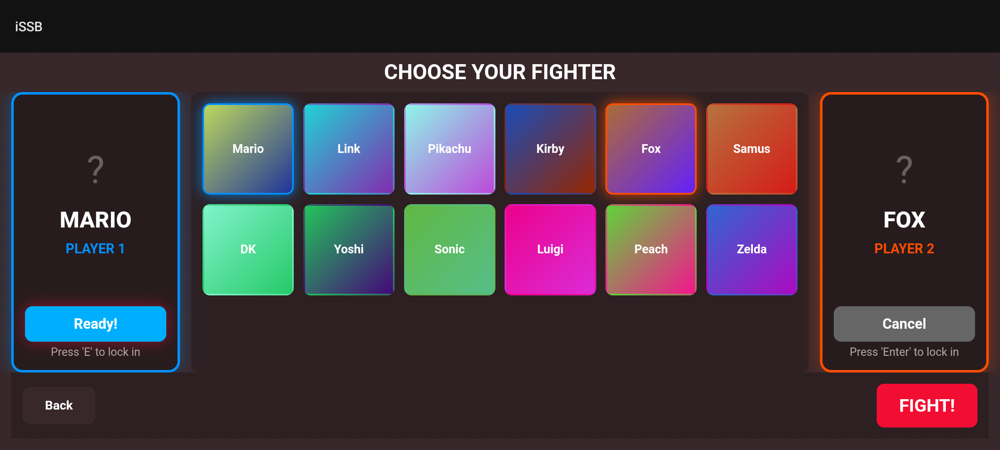
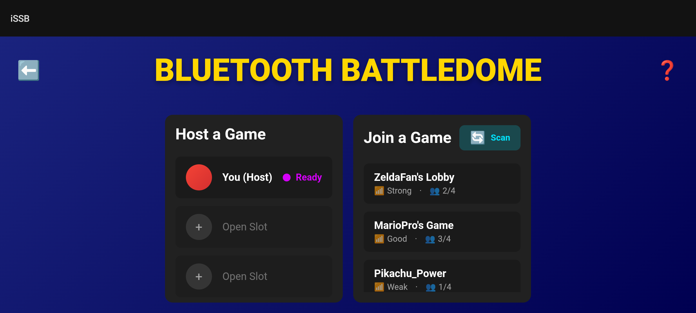
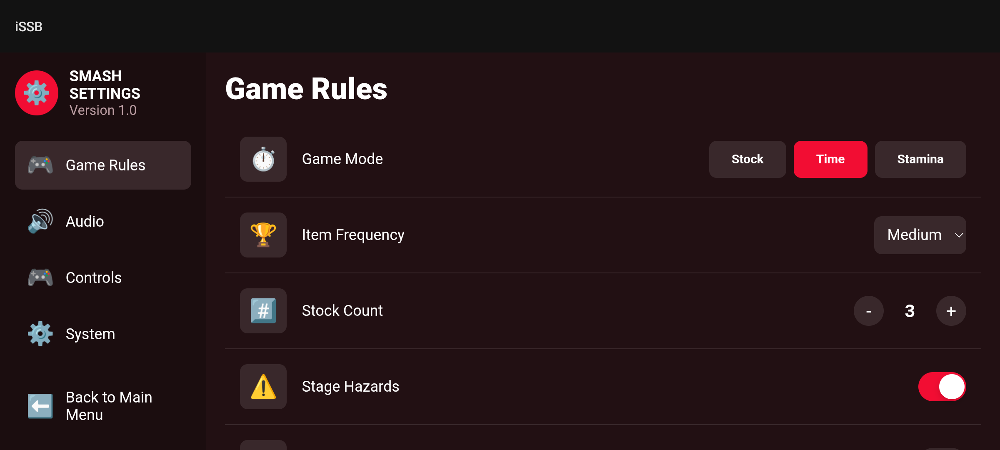

iSSB
====

A cross-platform "Super Smash Bros. Brawl" fan-game

This project uses git submodules, so in order to download it, you'll have to clone it recursively:

```bash
git clone --recursive https://github.com/lufinkey/iSSB
```

## Screenshots

### Character Select

Modern character selection screen with support for multiple players and gamepad controls.

### Multiplayer

Bluetooth multiplayer lobby system for connecting with friends.

### Settings

Comprehensive game rules configuration including game modes, item frequency, and stage hazards.

## Development Notes

This project has been in development for **several years**, evolving from a desktop fan-game into a fully-featured Android experience. While AI assistance was utilized during the recent Android modernization and UI overhaul, the core game engine, character mechanics, physics system, and original gameplay implementations represent years of dedicated manual development work.

**Recent Updates:**
- ✅ Modern WebView-based menu system
- ✅ Full controller support (Nintendo Pro, PS4, PS5, Xbox) - [See details](CONTROLLER_SUPPORT.md)
- ✅ True fullscreen rendering on Android devices
- ✅ Adaptive UI scaling for all screen sizes
- ✅ Character select, stage select, and settings menus
- ✅ Bluetooth multiplayer support
- ✅ Paper Mario character integration

## Controller Support

iSSB supports a wide range of gaming controllers on Android:
- 🎮 **Nintendo Pro Controller** - Full support via Bluetooth or USB
- 🎮 **PlayStation 5 DualSense** - Full support with rumble
- 🎮 **PlayStation 4 DualShock 4** - Full support
- 🎮 **Xbox Series X/S Controller** - Full support
- 🎮 **Xbox One Controller** - Full support
- 🎮 **Xbox 360 Controller** - USB support

See [CONTROLLER_SUPPORT.md](CONTROLLER_SUPPORT.md) for detailed button mappings and troubleshooting.

The game features a custom C++ engine built on SDL2, with hand-crafted character animations, attack systems, and stage mechanics developed over multiple years of iteration.